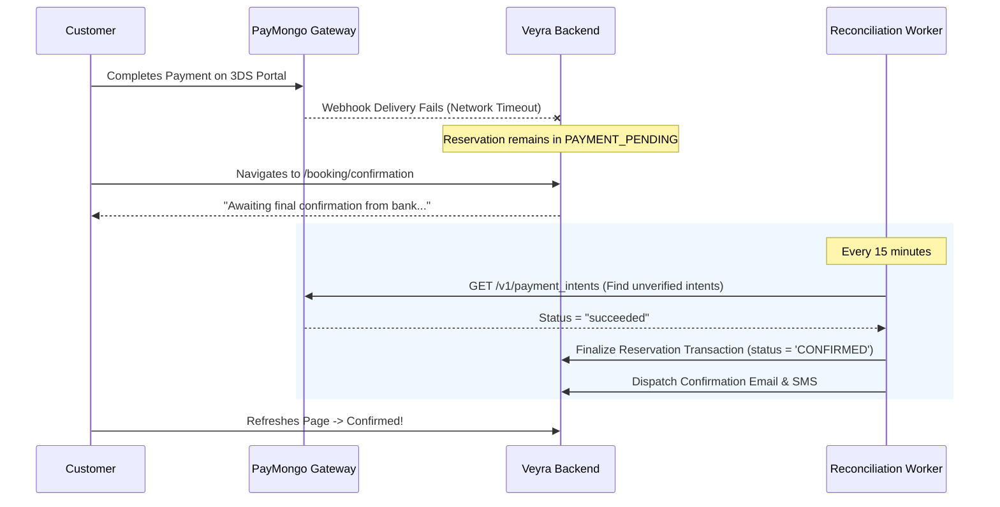

# Veyra Failure Modes, Resiliency & Recovery Architecture

This document defines the failure modes, automated self-healing mechanisms, degraded operating models, and administrative recovery procedures for all mission-critical subsystems across Veyra.

---

## 1. System Failure Matrix

| Failure Scenario | Severity | Impact | Automated Healing / Mitigation | Manual Recovery Procedure |
|---|---|---|---|---|
| **1. Dropped / Missed Payment Webhook** | High | Customer charged on PayMongo, but reservation remains in `PAYMENT_PENDING` or auto-expires | Scheduled reconciliation job (`job_reconcile_unsettled_payments`) queries PayMongo API every 15m; auto-confirms reservation if charge succeeded | Admin can click "Sync Payment Status" from Admin Reservation Detail view to trigger instant API reconciliation |
| **2. Customer Browser Drop During 3DS Redirect** | Medium | User closes window during bank OTP challenge | PayMongo webhook arrives independently of browser state; server updates DB and sends confirmation email; user sees booking in account upon login | User can log in to "My Bookings" to view confirmed reservation |
| **3. Database Connection Exhaustion (503 / Timeout)** | Critical | New bookings and admin queries fail | Supabase connection pooling (PgBouncer / Supavisor); Next.js API routes return HTTP 503 with `Retry-After: 5`; client retries with jitter | Ops checks long-running queries via Supabase dashboard; auto-scales pooler connections |
| **4. Email / SMS Provider Outage** | Low-Medium | Customers do not receive immediate email/SMS confirmation | Notifications queued in `notifications` table; retry worker uses exponential backoff up to 24 hours | Staff can resend confirmation email directly from admin reservation panel once provider recovers |
| **5. Vehicle Breakdown Mid-Rental** | High | Customer vehicle disabled on road; safety and itinerary disruption | 24/7 Roadside Concierge dispatch; Roadside incident ticket created in system | Staff assigns replacement fleet vehicle using the "Emergency Vehicle Swap" workflow; reservation continues under new VIN |
| **6. Concurrent Availability Race Condition** | Medium | Two users attempt to book the final vehicle of a class at the exact same second | Postgres `SELECT ... FOR UPDATE` serializes lock acquisition; first transaction succeeds; second transaction receives structured error `VEHICLE_NO_LONGER_AVAILABLE` | User interface suggests next best alternative model or alternate branch |
| **7. Storage Upload Failure During KYC** | Low | Customer submits booking, but license photo failed to upload to private bucket | Client verifies upload completion via signed upload ticket before allowing reservation submission; atomic check rejects form if file missing | Customer can re-upload document in "Account > Verification Documents" |
| **8. Double-Charge on Client Double-Click** | High | Customer clicks "Pay Now" twice rapidly | Idempotency keys (`idempotency_key = 'pay_res_' || reservation_id || '_' || quote_version`) enforced by backend and forwarded to PayMongo | If duplicate succeeds at gateway due to separate keys, Finance executes one-click refund in Admin UI |

---

## 2. In-Depth Recovery Workflows

### 2.1 Webhook Loss & Asynchronous Payment Reconciliation


---

### 2.2 Emergency Vehicle Swap (Mid-Rental Breakdown)
When a vehicle suffers a mechanical malfunction during an active rental:

1. **Staff Action in Admin Console:**
   * Staff navigates to active reservation `VY-XXXX-XX`.
   * Clicks **"Emergency Vehicle Substitution"**.
2. **System Execution:**
   * Staff selects an available replacement vehicle from current branch or dispatched mobile tow unit.
   * System verifies replacement vehicle availability for remainder of trip duration.
   * Transaction updates:
     * Previous vehicle status -> `'MAINTENANCE'` (reason: `'BREAKDOWN_DISPATCH'`).
     * Creates `damage_reports` or `maintenance_records` entry.
     * Updates reservation `fleet_vehicle_id` to new vehicle.
     * Adjusts `availability_blocks` records seamlessly.
     * If replacement vehicle is of higher class, rate difference is waived automatically (customer courtesy protection).
3. **Audit Trail:**
   * Appends full incident details and authorizer staff ID to `audit_logs`.
   * Auto-generates updated rental contract addendum and SMS notification to driver.

---

### 2.3 Concurrent Hold Collision Recovery
When two customers attempt to hold the last available SUV for the same dates:

1. **User A and User B click "Hold & Reserve" simultaneously:**
   * Both requests hit `/api/v1/reservations/hold`.
2. **Backend Concurrency Serialization:**
   * Database begins transaction for User A.
   * `SELECT id FROM fleet_vehicles WHERE ... FOR UPDATE` acquires row lock.
   * User B's transaction blocks waiting for lock release.
   * User A's transaction succeeds, creates `availability_blocks`, and commits.
   * User B's lock query resumes, runs overlap check, detects User A's block, and returns zero available vehicles.
3. **Graceful Client Degradation:**
   * User B's frontend receives HTTP 409 Conflict with payload:
     ```json
     {
       "error": "INVENTORY_UNAVAILABLE",
       "message": "This vehicle was just reserved by another customer.",
       "alternatives": [
         { "vehicle_id": "veh_audi_q7", "name": "Audi Q7", "price_diff_centavos": 0 }
       ]
     }
     ```
   * Frontend displays a helpful alternative recommendation banner rather than an unhandled crash screen.

---

## 3. Disaster Recovery & Database Point-in-Time Recovery (PITR)

* **Supabase Automated Backups:**
  Daily physical backups enabled with 7-day Point-in-Time Recovery (PITR) continuous write-ahead log (WAL) archiving.
* **Recovery Time Objective (RTO):**
  * Target RTO < 30 minutes for total database restoration.
* **Recovery Point Objective (RPO):**
  * Target RPO < 5 minutes (zero data loss for confirmed financial transactions).
* **Storage Bucket Replication:**
  Customer KYC identity documents in private Supabase Storage buckets configured with multi-region object redundancy.
