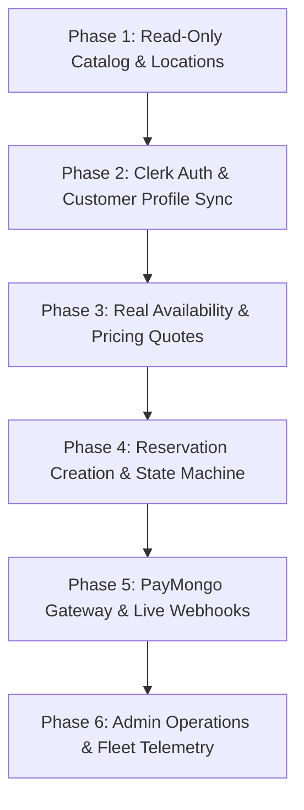

# Veyra Mock-to-Production Backend Migration Strategy

This document outlines the phased migration strategy for transitioning Veyra from its current mock-data prototype state to a fully production-grade, database-backed architecture using Supabase and Clerk.

---

## 1. Architectural Strategy: Repository Abstraction Pattern

To ensure seamless transition without rewriting UI components or breaking existing client state, all data access will route through typed repository interfaces.

### 1.1 Repository Interface Architecture
```
src/lib/data/
├── interfaces/
│   ├── vehicle-repository.interface.ts
│   ├── location-repository.interface.ts
│   ├── reservation-repository.interface.ts
│   └── customer-repository.interface.ts
├── mock/
│   ├── mock-vehicle.repository.ts
│   ├── mock-location.repository.ts
│   └── ... (wraps existing src/lib/mock/*)
├── supabase/
│   ├── supabase-vehicle.repository.ts
│   ├── supabase-location.repository.ts
│   └── ... (calls @supabase/supabase-js)
└── factory.ts (resolves repo based on NEXT_PUBLIC_DATA_SOURCE)
```

### 1.2 Factory Resolution Example
```typescript
// src/lib/data/factory.ts
import { IVehicleRepository } from './interfaces/vehicle-repository.interface';
import { MockVehicleRepository } from './mock/mock-vehicle.repository';
import { SupabaseVehicleRepository } from './supabase/supabase-vehicle.repository';

export function getVehicleRepository(): IVehicleRepository {
  if (process.env.DATA_SOURCE === 'supabase') {
    return new SupabaseVehicleRepository();
  }
  return new MockVehicleRepository();
}
```
* **Benefit:** Allows feature-by-feature cutover without high-risk "big-bang" refactoring. UI components only call `getVehicleRepository().getFeaturedVehicles()`.

---

## 2. Six-Phase Incremental Cutover Blueprint



### Phase 1: Read-Only Public Catalog & Locations
* **Scope:** `locations`, `vehicle_categories`, `vehicle_models`, `vehicle_features`, `faqs`.
* **Actions:**
  1. Apply PostgreSQL schema for catalog tables.
  2. Seed catalog tables from `MOCK_VEHICLES` and `MOCK_LOCATIONS`.
  3. Switch `NEXT_PUBLIC_CATALOG_SOURCE=supabase`.
  4. Search and browse pages query Supabase public tables via standard caching (`fetch(..., { next: { revalidate: 3600 } })`).
* **Risk:** Extremely low. Read-only public data; no financial or auth impact.

### Phase 2: Clerk Authentication & Customer Profile Sync
* **Scope:** Clerk authentication provider wrapping root layout; Clerk webhook syncing user to Supabase `users` and `customers`.
* **Actions:**
  1. Add `<ClerkProvider>` to root layout with Veyra design-system branding.
  2. Implement `POST /api/webhooks/clerk` with Svix signature verification.
  3. Replace mock customer session in account pages with real `useUser()` and Supabase customer profile query.
* **Fallback:** If Clerk is unavailable, auth falls back to graceful error notification.

### Phase 3: Real Availability & Server-Authoritative Pricing Quotes
* **Scope:** Replace mock availability boolean with SQL `tsrange` overlap checks. Replace client-side pricing calculation with `/api/v1/quotes/calculate`.
* **Actions:**
  1. Deploy `calculate_quote` and `check_vehicle_availability` Postgres functions.
  2. Search UI calls real availability query rather than hardcoded mock filter.
  3. Quote snapshot persisted to `quotes` table with a 15-minute TTL.

### Phase 4: Reservation Creation & State Machine
* **Scope:** Booking checkout creates real `reservations` in `HELD` state.
* **Actions:**
  1. Connect booking checkout form to Server Action executing the atomic hold transaction.
  2. Enforce 15-minute hold timer in booking summary UI.
  3. Deploy `job_expire_stale_holds` via `pg_cron`.

### Phase 5: PayMongo Gateway & Live Webhooks
* **Scope:** Real credit card, GCash, and Maya checkout sessions.
* **Actions:**
  1. Integrate PayMongo Checkout API in test mode.
  2. Deploy `POST /api/webhooks/paymongo` with signature validation.
  3. Validate end-to-end payment confirmation, automatic state transition to `CONFIRMED`, and email voucher delivery.
  4. Switch PayMongo environment keys from `pk_test_...` to `pk_live_...`.

### Phase 6: Admin Operations & Fleet Telemetry
* **Scope:** Admin reservations table, fleet status, inspection forms, check-in/check-out workflows.
* **Actions:**
  1. Admin portal queries Supabase with staff Clerk session and RLS role verification.
  2. Real-time updates via Supabase Realtime for vehicle status changes.
  3. Decommission mock data files once all admin flows pass smoke tests.

---

## 3. Database Seeding Strategy

To ensure dev, staging, and production environments start with consistent, realistic data:

1. **Seed Script Pipeline (`supabase/seed.sql`):**
   * Translates current `MOCK_LOCATIONS` into 4 real branches (NAIA Terminal 3, BGC Taguig, Makati CBD, Mactan-Cebu Airport).
   * Translates `MOCK_VEHICLES` into `vehicle_classes`, `vehicle_models`, and specifications.
   * Creates initial `fleet_vehicles` with realistic Philippine license plates (`NCM 8291`, `NBC 4910`, etc.) and VINs.
   * Seeds system rate plans and extras (Child Safety Seat, Additional Driver, Full Protection Waiver).
2. **Idempotency Requirement:**
   * All seed statements MUST use `ON CONFLICT (id) DO UPDATE` or `ON CONFLICT DO NOTHING` to allow safe re-execution in CI/CD environments.

---

## 4. Rollback & Contingency Plan

If critical defects or service outages occur during any cutover phase:
1. **Immediate Feature Flag Reversion:**
   Set `DATA_SOURCE=mock` in Vercel environment variables and trigger instant redeployment (<60s).
2. **Database Data Preservation:**
   Any real customer bookings created in Supabase during a partial rollout are exported to CSV/JSON to ensure no customer reservation is lost or forgotten during a rollback.
3. **Customer Communication:**
   If a payment succeeded in PayMongo but reservation failed during cutover, automated webhook alert flags the incident in Ops Slack channel for manual booking creation within 15 minutes.
