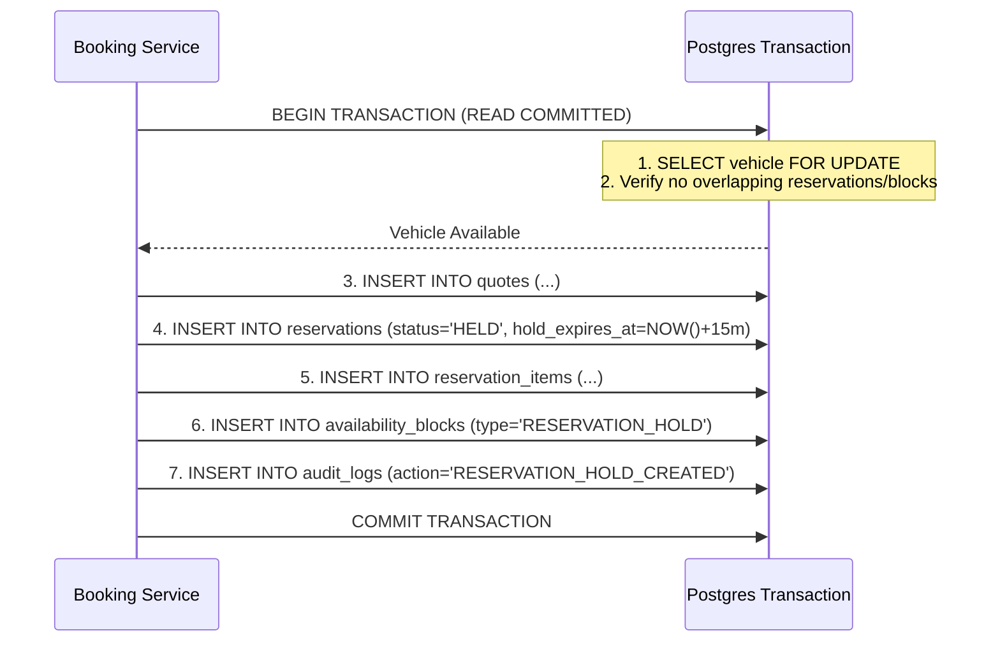

# Veyra Database Transaction Boundaries & Atomicity Standards

This document defines the atomic units of work, database transaction boundaries, concurrency isolation levels, and rollback invariants across all multi-entity operations in the Veyra platform.

---

## 1. Core Principles of Transaction Management

1. **All-or-Nothing Guarantees:**
   Multi-table domain operations must execute inside an explicit database transaction (`BEGIN ... COMMIT`). If any intermediate statement fails, the entire transaction rolls back cleanly.
2. **Short-Lived Transactions:**
   Never make external network calls (e.g., PayMongo API, Resend email API, Supabase Storage uploads) *inside* an open database transaction. External latency holds table locks and exhausts connection pools.
3. **Optimistic vs. Pessimistic Concurrency:**
   * **Pessimistic Locking (`SELECT FOR UPDATE`):** Used during vehicle allocation and reservation hold creation to guarantee zero double-bookings under race conditions.
   * **Optimistic Locking (`version` column):** Used for concurrent updates to customer profiles and vehicle master catalog records.
4. **Default Isolation Level:**
   PostgreSQL default `READ COMMITTED` is used for all transactions, augmented with explicit row-level locks (`FOR UPDATE`) on the availability constraint boundary.

---

## 2. Mandatory Atomic Transactions

### 2.1 Unit of Work: Reservation Hold Creation
Executed when a customer clicks "Proceed to Checkout" or confirms vehicle selection.



* **Rollback Invariants:**
  * If the vehicle has a concurrent overlapping hold inserted 1 millisecond earlier, step 2 fails and the entire transaction rolls back.
  * No orphaned quote or hold record can exist without its corresponding `availability_blocks` row.

---

### 2.2 Unit of Work: Payment Confirmation & Booking Finalization
Executed when a verified PayMongo `payment.paid` webhook arrives or in-app checkout completes.

* **Transaction Scope:**
  ```sql
  BEGIN;
    -- 1. Lock the reservation row
    SELECT id, status, total_amount_centavos 
    FROM reservations 
    WHERE id = p_reservation_id 
    FOR UPDATE;

    -- 2. Verify state is valid for confirmation
    IF status NOT IN ('HELD', 'PAYMENT_PENDING') THEN
      RAISE EXCEPTION 'Invalid reservation state for payment confirmation: %', status;
    END IF;

    -- 3. Record the verified payment
    INSERT INTO payments (
      id, reservation_id, provider_payment_id, amount_centavos, status, payment_method
    ) VALUES (...);

    -- 4. Transition reservation status
    UPDATE reservations 
    SET status = 'CONFIRMED', 
        confirmed_at = NOW(), 
        updated_at = NOW() 
    WHERE id = p_reservation_id;

    -- 5. Upgrade availability block from temporary hold to firm booking
    UPDATE availability_blocks 
    SET block_type = 'CONFIRMED_RESERVATION',
        expires_at = NULL 
    WHERE reservation_id = p_reservation_id;

    -- 6. Generate invoice record
    INSERT INTO invoices (
      reservation_id, invoice_number, total_amount_centavos, tax_amount_centavos, status
    ) VALUES (...);

    -- 7. Record status transition history and audit log
    INSERT INTO reservation_status_history (reservation_id, from_status, to_status, actor_type)
    VALUES (p_reservation_id, 'HELD', 'CONFIRMED', 'SYSTEM');

    INSERT INTO audit_logs (action, target_entity, target_id, payload)
    VALUES ('RESERVATION_CONFIRMED', 'reservations', p_reservation_id, ...);
  COMMIT;
  ```
* **Post-Commit Phase (Outside Transaction):**
  * Enqueue `job_dispatch_notification` to send confirmation email and SMS.

---

### 2.3 Unit of Work: Vehicle Dispatch & Pickup Check-In
Executed by Branch Staff when the customer arrives to claim the vehicle.

* **Transaction Scope:**
  1. Lock `reservations` and `fleet_vehicles` rows via `FOR UPDATE`.
  2. Verify driver license is verified and required security deposit is authorized.
  3. Insert `inspections` record (pre-trip mileage, fuel level, checklist, photo references).
  4. Update `fleet_vehicles.status = 'RENTED'`.
  5. Transition reservation status: `PICKUP_READY` -> `ACTIVE`.
  6. Insert `reservation_status_history` and `audit_logs`.
* **Rollback Trigger:**
  * If the assigned fleet vehicle is suddenly marked `IN_MAINTENANCE` by another staff member, transaction aborts.

---

### 2.4 Unit of Work: Vehicle Return, Damage Settlement & Closeout
Executed by Branch Staff upon return.

* **Transaction Scope:**
  1. Lock `reservations`, `fleet_vehicles`, and `deposits` rows.
  2. Insert return inspection record (post-trip mileage, fuel deficit, damages).
  3. If excess mileage or fuel deficit detected:
     * Insert incidental charges into `reservation_items`.
     * Update invoice total.
  4. If new damage reported:
     * Insert `damage_reports` row.
     * Flag security deposit for partial or full capture.
  5. Else (clean return):
     * Mark `deposits.status = 'RELEASE_PENDING'`.
  6. Update `fleet_vehicles.status = 'CLEANING'`.
  7. Transition reservation status: `RETURN_INSPECTION` -> `COMPLETED`.
  8. Release `availability_blocks` row so vehicle can be booked for future dates.
  9. Commit transaction.
* **Post-Commit Phase:**
  * Trigger PayMongo API deposit capture or release outside the DB transaction.

---

### 2.5 Unit of Work: Cancellation & Refund Processing
Executed when a customer or staff cancels an eligible reservation.

* **Transaction Scope:**
  1. Lock reservation and quote records.
  2. Calculate refund entitlement based on cancellation policy rules (<24h vs >=24h).
  3. Transition reservation status: `CONFIRMED` -> `CANCELLED`.
  4. Delete or release corresponding `availability_blocks` records.
  5. Insert `refunds` row (`status = 'PENDING_PROVIDER_DISPATCH'`).
  6. Insert audit trail record.
  7. Commit transaction.
* **Post-Commit Phase:**
  * Background worker calls PayMongo Refund API; updates `refunds.status = 'PROCESSED'` on success.

---

## 3. Concurrency & Deadlock Prevention Rules

To guarantee transactions never produce deadlocks:
1. **Strict Lock Ordering:**
   When multiple entities are locked in a single transaction, always acquire locks in alphabetical table order:
   `branches` -> `fleet_vehicles` -> `reservations` -> `payments`
2. **Lock Timeouts:**
   All transaction sessions must enforce a lock timeout to prevent indefinite queuing:
   ```sql
   SET LOCAL lock_timeout = '3000ms';
   ```
   If a lock cannot be acquired within 3 seconds, Postgres raises `55P03 (lock_not_available)`, triggering a polite retry in the application layer.
