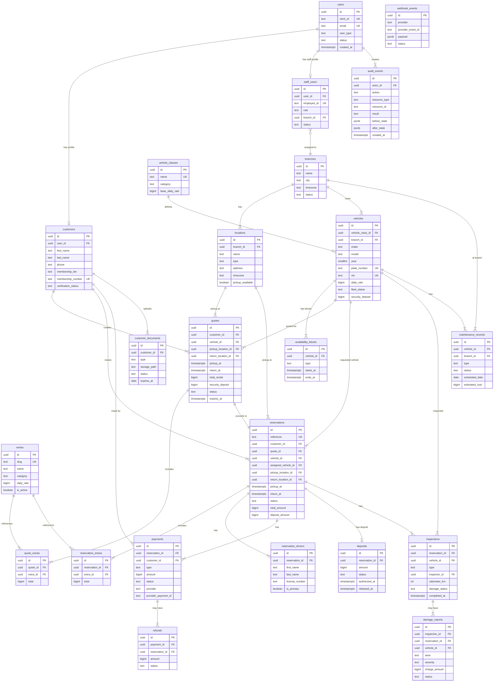

# Veyra Entity Relationship Diagram

**Phase 7 — Architecture Blueprint (Design-Only)**
**Status:** Design document. No tables exist yet.
**Date:** September 2026

---

## Core ERD

---

## Relationship Notes

### User Identity
- Every `users` row has exactly one Clerk identity (`clerk_id`)
- A `users` row has either a `customers` or `staff_users` profile, never both
- `staff_users.branch_id` may be NULL for admins/superadmins with organization-wide access

### Pricing Integrity
- `quotes` record a price snapshot at the moment of quoting
- `reservations.quote_id` references this immutable snapshot
- `reservation_extras` replicates the extra name and rate from the quote — changing an `extras` record later does not affect existing reservations

### Availability Model
- Vehicle availability = the vehicle has no overlapping `reservations` in status `held`, `payment_pending`, `confirmed`, `pickup_ready`, `active`, `return_inspection` AND no overlapping `availability_blocks`
- Both conditions must be checked atomically in a transaction

### Deposit vs Payment
- `deposits` track the refundable security hold separately from rental payments
- A reservation has one `deposits` record and one or more `payments` records
- The deposit is authorized at pickup by the payment provider and released after clean return inspection

### Vehicle Model (Requested vs Assigned Physical Vehicle)
- `reservations.vehicle_id` = The specific physical fleet vehicle selected by the customer. Availability is locked against this vehicle.
- `reservations.assigned_vehicle_id` = The actual physical vehicle confirmed by staff at pickup. Defaults to `vehicle_id`, but may differ in audited substitution scenarios (e.g. mechanical failure).
- Both FKs point to `public.vehicles(id)`.
- Public catalog queries access `public.vehicle_catalog` view rather than the raw `vehicles` table, shielding sensitive fleet data (VIN, plate, maintenance).

### Audit Trail
- `audit_events` is append-only (no UPDATE, no DELETE)
- Every status transition in `reservations`, `payments`, `refunds`, `deposits`, `vehicles`, and `customer_documents` must create an audit event
- `actor_id` is always a real `users.id` — system actions use a dedicated system user
